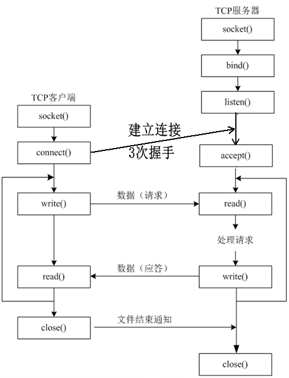

# 网络编程的知识点

## 一些函数

Learn

### BSD Socket API

对应资料：[博客园](https://www.cnblogs.com/god-of-death/p/7152387.html)

### recvfrom

对应资料：[CSDN](https://blog.csdn.net/weixin_43844521/article/details/133659725)
对应代码：[UdpSocket.cpp](../../src/network/net/UdpSocket.cpp#L36)
```cpp
auto ret = ::recvfrom(fd_, message_buffer_.BeginWrite(), message_buffer_size_, 0,
                              (struct sockaddr *)&sock_addr, &len);
```

## 管道
Learn

## TCP 网络编程流程
对应资料：[CSDN](https://blog.csdn.net/tennysonsky/article/details/45621341)

基于 TCP 的网络编程开发分为服务器端和客户端两部分，常见的核心步骤和流程如下：



## 地址转换

对应代码：[SocketOpt](../../src/network/base/InetAddress.cpp#L92)
```cpp
struct sockaddr_in *addr_in = (struct sockaddr_in *)saddr;
    memset(addr_in, 0x00, sizeof(struct sockaddr_in));
    addr_in->sin_family = AF_INET;
    addr_in->sin_port = htons(std::atoi(port_.c_str()));
    if (::inet_pton(AF_INET, addr_.c_str(), &addr_in->sin_addr) < 0)
    {
        NETWORK_ERROR << "ipv4 ip:" << addr_ << "convert error";
    }
```

1. 初始化sockaddr_in结构体：使用memset清零内存
2. 设置地址族：sin_family = AF_INET表示IPv4协议
3. 端口号转换：
   - 使用atoi将字符串端口号转为整数
   - htons函数将主机字节序转为网络字节序
4. IP地址转换：
   - inet_pton函数将点分十进制IP字符串(如"192.168.1.1")转为二进制格式
   - 转换失败时记录错误日志

关键函数说明：
- inet_pton：将IPv4/IPv6地址从文本格式转为二进制格式
- htons：将16位无符号整数从主机字节序转为网络字节序
- memset：初始化内存区域，防止未初始化数据导致的问题

## 接受连接后的地址解析

对应代码：[SocketOpt](../../src/network/base/SocketOpt.cpp#L66)
```cpp
if (addr.sin6_family == AF_INET)
{
    char ip[16] = {0};
    struct sockaddr_in *saddr = (struct sockaddr_in *)&addr;
    ::inet_ntop(AF_INET, &(saddr->sin_addr.s_addr), ip, sizeof(ip));
    peeraddr->SetAddr(ip);
    peeraddr->SetPort(ntohs(saddr->sin_port));
}
else if (addr.sin6_family == AF_INET6)
{
    char ip[INET6_ADDRSTRLEN] = {0};
    ::inet_ntop(AF_INET6, &(addr.sin6_addr), ip, sizeof(ip));
    peeraddr->SetAddr(ip);
    peeraddr->SetPort(ntohs(addr.sin6_port));
    peeraddr->SetIsIPV6(true);
}
```

1. 区分地址类型：通过sin6_family判断是IPv4(AF_INET)还是IPv6(AF_INET6)
2. IPv4地址处理：
   - 使用16字节缓冲区存储转换后的IP字符串
   - 通过inet_ntop将二进制地址转为点分十进制格式
   - 使用ntohs转换端口号为主机字节序
3. IPv6地址处理：
   - 使用INET6_ADDRSTRLEN(46字节)缓冲区
   - 同样使用inet_ntop转换地址格式
   - 设置is_ipv6标志为true
4. 结果存储：将解析后的IP和端口设置到peeraddr对象中

